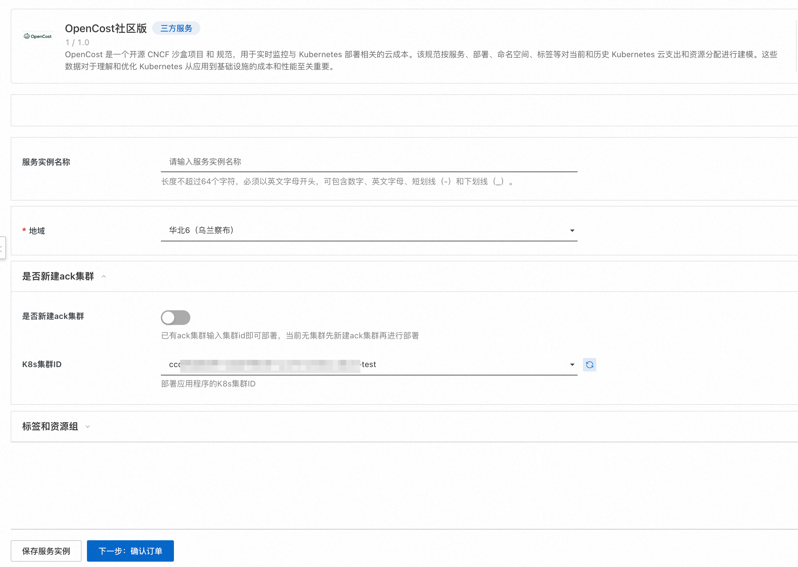
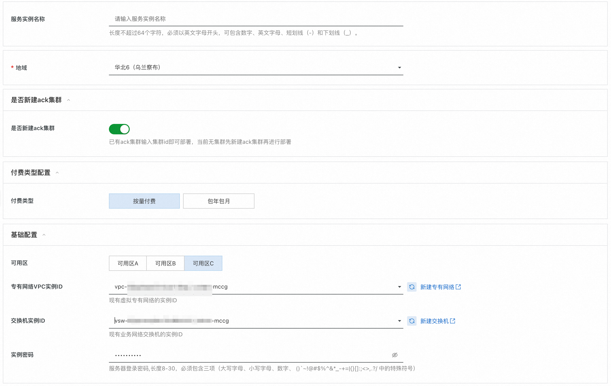
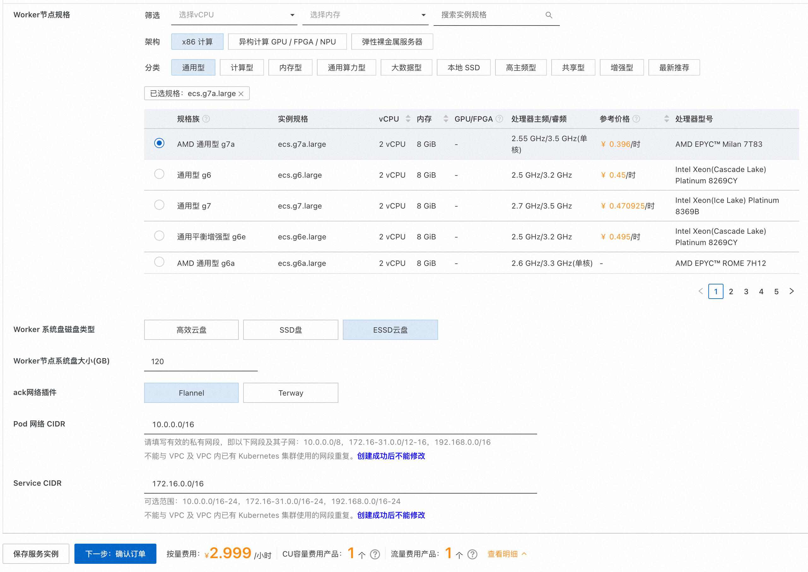
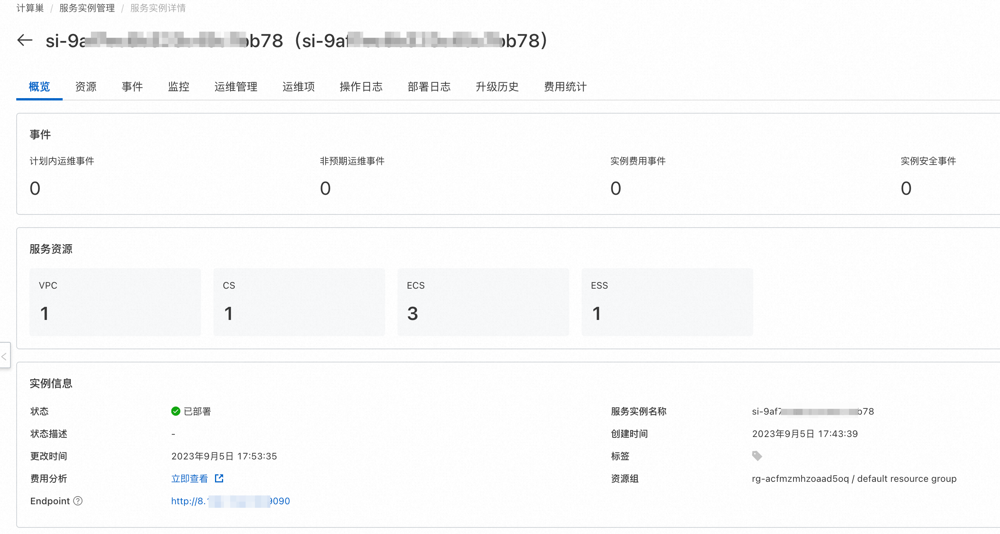
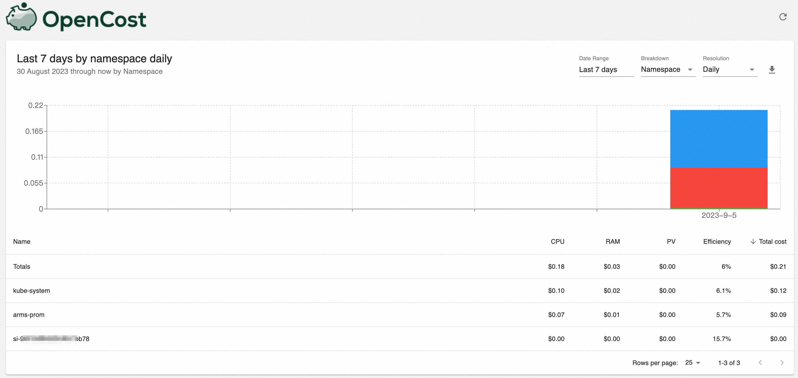
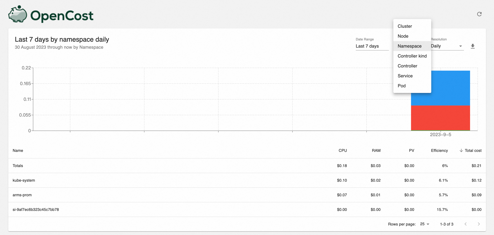

# OpenCost服务实例部署文档

## 概述
OpenCost是一种云成本监控工具，与Kubernetes无缝集成，允许实时跟踪云支出，从而相应地优化资源。 
OpenCost是一个开源的CNCF沙盒项目和规范，用于实时监控与Kubernetes部署相关的云成本。 该规范按服务、部署、命名空间、标签等对当前和历史的Kubernetes云支出和资源分配进行了建模。

## 实例说明
OpenCost为开源社区版，源码参考[Github Repo](https://github.com/opencost/opencost)，服务可免费使用，用户仅需对云资源付费即可，具体费用见创建服务实例时费用预估。

## 部署流程

### 部署步骤

#### 1.部署入口
您可以在阿里云计算巢自行搜索，也可以通过下述部署链接快速到达。

[部署链接](https://computenest.console.aliyun.com/user/cn-hangzhou/serviceInstanceCreate?ServiceId=service-93641499344c4a0d9fad)

#### 2.创建服务实例
##### 2.1 已有ack集群部署

用户已有ack集群的情况下，进行如下操作：

- 选择ack集群所在地域
- 是否新建ack集群选择否
- 选择已有的k8s集群

##### 2.2 新建ack集群部署

新建ack集群的情况下，进行如下操作：

- 选择地域、付费类型。
- 选择可用区，并在可用区下选择vpc实例和交换机实例，不存在的情况下点击右侧按钮新建。
- 选择ack节点规格、磁盘类型和磁盘大小，默认集群节点数为3台。
- 选择ack网络插件，目前支持flannel和terway,并分别填入对应的pod网段和service网段。

##### 2.3 服务实例详情

其中的Endpoint为服务实例的访问地址，用户可以通过该地址访问服务。

### 服务验证
访问服务实例详情页的Endpoint，可以看到k8s集群内部不同namespace消耗情况。

切换不同的维度，可以查看pod、service、node等消耗情况。

