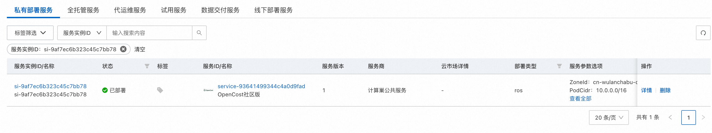

# OpenCost服务实例部署文档

## 概述
OpenCost是一种云成本监控工具，与Kubernetes无缝集成，允许实时跟踪云支出，从而相应地优化资源。 
OpenCost是一个开源的CNCF沙盒项目和规范，用于实时监控与Kubernetes部署相关的云成本。 该规范按服务、部署、命名空间、标签等对当前和历史的Kubernetes云支出和资源分配进行了建模。
本文向您介绍如何开通计算巢上的OpenCost服务，以及部署流程和使用说明。

## 计费说明
OpenCost为开源社区版，源码参考[Github Repo](https://github.com/opencost/opencost)，服务可免费使用。
目前支持两种模式进行部署。

- 已有阿里云ack集群，这种情况下可以直接将服务部署到该集群中，用户不需付费。
- 新建阿里云ack集群，然后部署服务，这种情况下只用支付ack资源本身的费用。
  
OpenCost在计算巢上的费用主要涉及：

- 所选vCPU与内存规格
- 磁盘容量
- 公网带宽
- ack集群费用

计费方式包括：

- 按量付费（小时）
- 包年包月

预估费用在创建实例时可实时看到。

## 部署架构
OpenCost服务为容器服务，部署在ack集群上。

## RAM账号所需权限
OpenCost服务需要对ECS、VPC、ACK等资源进行访问和创建操作，若您使用RAM用户创建服务实例，需要在创建服务实例前，对使用的RAM用户的账号添加相应资源的权限。添加RAM权限的详细操作，请参见[为RAM用户授权](https://help.aliyun.com/document_detail/121945.html)。所需权限如下表所示。

| 权限策略名称 | 备注 |
| --- | --- |
| AliyunECSFullAccess | 管理云服务器服务（ECS）的权限 |
| AliyunVPCFullAccess | 管理专有网络（VPC）的权限 |
| AliyunROSFullAccess | 管理资源编排服务（ROS）的权限 |
| AliyunComputeNestUserFullAccess | 管理计算巢服务（ComputeNest）的用户侧权限 |
| AliyunCloudMonitorFullAccess | 管理云监控（CloudMonitor）的权限 |
| AliyunCSFullAccess | 管理容器服务(CS)的权限 |

## 部署流程

### 部署步骤
单击[部署链接](https://computenest.console.aliyun.com/user/cn-hangzhou/serviceInstanceCreate?ServiceId=service-93641499344c4a0d9fad)，进入服务实例部署界面，根据界面提示，填写参数完成部署。

### 部署参数说明
您在创建服务实例的过程中，需要配置服务实例信息。下文介绍OpenCost服务实例输入参数的详细信息。
#### 已有ack集群
是否新建ack集群参数选择否时，代表现在已有ack集群，此时需要填写以下参数。

| 参数组       | 参数项       | 示例                              | 说明                           |
|-----------|-----------|---------------------------------|------------------------------|
| 服务实例名称    |           | test                            | 实例的名称                        |
| 地域        |           | 华东1（杭州）                         | 选中服务实例的地域，建议就近选中，以获取更好的网络延时。 |
| 是否新建ack集群 | 是否新建ack集群 | 否                               | 选择否代表已有ack集群，不用新建            |
| 是否新建ack集群 | K8s集群ID   | ccde6deb0f612402786e611a7e1230d | 根据地域选择地域中用户已有的集群id           |

#### 新建ack集群

| 参数组          | 参数项               | 示例            | 说明                                                                                                                                    |
|--------------|-------------------|---------------|---------------------------------------------------------------------------------------------------------------------------------------|
| 服务实例名称       |                   | test          | 实例的名称                                                                                                                                 |
| 地域           |                   | 华东1（杭州）       | 选中服务实例的地域，建议就近选中，以获取更好的网络延时。                                                                                                          |
| 是否新建ack集群    |                   | 是             | 选择是代表新建ack集群                                                                                                                          |
| 付费类型配置       | 付费类型              | 按量付费 或 包年包月   |                                                                                                                                       |
| 基础配置         | 可用区               | 可用区I          | 地域下的不同可用区域                                                                                                                            |
| 基础配置         | 专有网络VPC实例ID       | vpc-xxx       | 选择地域下可用的vpc,不存在可以新建                                                                                                                   |
| 基础配置         | 交换机实例ID           | vsw-xxx       | 选择vpc下的vsw，这个vsw筛选会受上面不同可用区域影响，不存在可以新建                                                                                                |
| 基础配置         | 实例密码              | ********      | 设置实例密码。长度8~30个字符，必须包含三项（大写字母、小写字母、数字、()~!@#$%^&*-+={}[]:;'<>,.?/ 中的特殊符号）                                                              |
| Kubernetes配置 | Worker节点规格        | 	ecs.g6.large | 选择对应cpu核数和内存大小的ecs实例，用作k8s节点                                                                                                          |
| Kubernetes配置 | Worker 系统盘磁盘类型    | ESSD云盘        | 选择k8s集群Worker节点使用的系统盘磁盘类型                                                                                                             |
| Kubernetes配置 | Worker节点系统盘大小(GB) | 120           | 设置Worker节点系统盘大小，单位为GB                                                                                                                 |
| Kubernetes配置 | ack网络插件           | Flannel       | ack集群对应的网络插件，可以选择Flannel或者Terway，网络插件不同，下面设置的pod网络参数不同                                                                                |
| Kubernetes配置 | Pod 网络 CIDR       | 10.0.0.0/16   | ack Pod网络段，网络插件为Flannel时必填，请填写有效的私有网段，即以下网段及其子网：10.0.0.0/8，172.16-31.0.0/12-16，192.168.0.0/16，不能与 VPC 及 VPC 内已有 Kubernetes 集群使用的网段重复。 |
| Kubernetes配置 | pod交换机实例ID        | vsw-xx        | ack Pod交换机实例id，网络插件为Terway时必填，建议选择网段掩码不大于 19 的虚拟交换机                                                                                   |
| Kubernetes配置 | Service CIDR      | 172.16.0.0/16 | ack Service网络段, 可选范围：10.0.0.0/16-24，172.16-31.0.0/16-24，192.168.0.0/16-24,不能与 VPC 及 VPC 内已有 Kubernetes 集群使用的网段重复。                     |

### 验证结果
1. 查看服务实例，服务实例创建成功后，部署时间大约需要2分钟。部署完成后，页面上可以看到对应的服务实例。

2. 点击详情，可以查看实例详情，对应页面如下：

3. 通过实例详情中Endpoint链接，可以访问OpenCost服务页面，查看集群内花费统计信息。

4. 在OpenCost服务页面切换不同的维度，可以查看pod、service、node等消耗情况。

